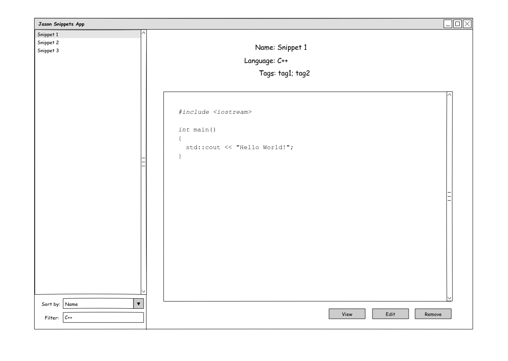

# JasonSnippets

Desktop application to manage your code snippets.

## Roadmap

* **Sprint 1**: Develop the presentation of the application until it is usable
* **Sprint 2**: Create complete data model. Add tagging system.
* **Sprint 3**: Create an extensible persistence system (connectors approach).
* **Sprint 4**: Develop search system (name, language and tag based).
* **Sprint 5**: Implementar pequeñas caracteristicas (font resize, change theme, etc).

## Setup

Create an asar package:
`asar pack jason jason.asar`
Execute electron framework with jason.asar param:
`electron jason.asar`

## Usage

TODO (for now it is not usable)

## 3rd party software

* Electron application (http://electron.atom.io)
* Google Code Prettify (https://github.com/google/code-prettify)

## License

[GNU General Public License v3](https://www.gnu.org/licenses/gpl-3.0.en.html "GNU General Public License v3")
